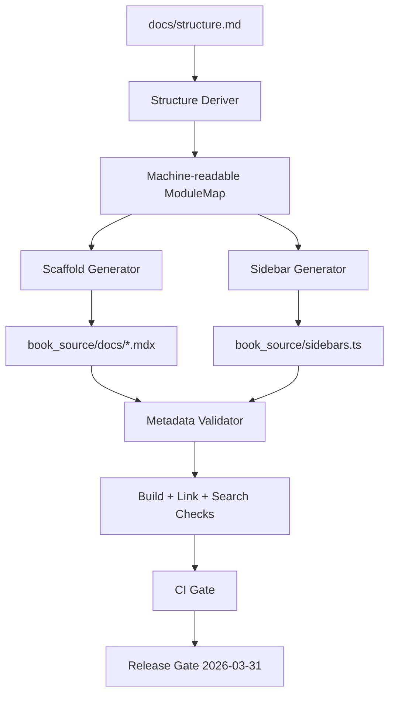

# Implementation Plan: Foundation & Core Skeleton

**Branch**: `001-docusaurus-core-skeleton` | **Date**: 2026-02-21 | **Spec**: [specs/001-docusaurus-core-skeleton/spec.md](specs/001-docusaurus-core-skeleton/spec.md)
**Input**: Feature specification from `/specs/001-docusaurus-core-skeleton/spec.md`

## Summary

Deliver a deterministic Docusaurus book scaffold where structure is sourced from `docs/structure.md`, chapter metadata is validated, and onboarding UX (search, dark mode, homepage, fonts, setup flow, blog baseline) is release-gated by measurable checks. Planning follows a **research-concurrent** model: verify external technical details while implementation tasks execute, not as a single upfront discovery batch.

## Architecture Sketch



## Section Structure (Phased)

### Phase 0 — Research & Framing (Concurrent)
- Establish verifiable choices for local search, metadata validation, link validation, font loading, and accessibility checks.
- Document decisions in `research.md` with alternatives and tradeoffs.
- Keep discovery open during implementation for unresolved operational details.

### Phase 1 — Design & Contracts
- Define data model in `data-model.md`.
- Define tooling/API contracts in `contracts/book-scaffold.openapi.yaml`.
- Define operator flow in `quickstart.md`.
- Update agent context via script.

### Phase 2 — Implementation Planning
- Sequence work by FR groups and acceptance criteria.
- Attach validation ownership per criterion using the matrix in spec.

## Technical Context

**Language/Version**: Node.js 20.x, TypeScript 5.x, Bash (POSIX-compatible for scripts)  
**Primary Dependencies**: Docusaurus 3.x, `@easyops-cn/docusaurus-search-local`, Markdown/MDX toolchain, link-check and metadata validation scripts  
**Storage**: File-based content and config (`docs/structure.md`, generated docs, sidebars, static assets)  
**Testing**: Build checks, metadata validators, link validators, route smoke checks, browser-network assertions  
**Target Platform**: Ubuntu 24.04 devcontainer + CI runners  
**Project Type**: Static documentation web application with build-time generation  
**Performance Goals**: Build finishes within CI default timeout; local search results available without external API dependency  
**Constraints**: Structure source is `docs/structure.md`; 0 broken internal links; mandatory frontmatter coverage; dark mode default  
**Scale/Scope**: 4 core modules + weekly/assessment/capstone structure from `docs/structure.md`

## Research Approach (Concurrent)

- Research runs in parallel with implementation slices.
- Each implementation task includes a "Verify" sub-step for external knowledge/docs.
- New findings are logged in `research.md` with impact on FR/SC traceability.
- No blocking "research-only" gate unless a safety or contract ambiguity appears.

## Constitution Check (Pre-Design)

*GATE: Must pass before Phase 0 research. Re-check after Phase 1 design.*

- ✅ SDD-RI primacy: spec exists before planning and execution.
- ✅ P+Q+P pattern: decisions include rationale + alternatives + proof checks.
- ✅ Output contract: Markdown/MDX deterministic structure is specified.
- ✅ Curriculum mapping: coverage matrix mapped to `docs/curriculum.md`.
- ✅ Atomic decomposition: phased structure and gate-based delivery defined.
- ✅ No vibe coding: all planned work maps to FR/SC in spec.
- ✅ Reusable skills: content generation, Urdu support, RAG/search, personalization included.
- ✅ Measurable release gate: SC-001..SC-012 by 2026-03-31.
- ⚠ Constitution item "IEEE citation and writing-grade checks" applies to authored chapter content; this feature is scaffold-first and will enforce these in later content-generation phases.

## Decisions Needing Documentation (Options & Tradeoffs)

1. **Structure Derivative Format**
   - Option A: JSON artifact committed in repo
   - Option B: YAML artifact committed in repo
   - Option C: Parse `docs/structure.md` directly at build time
   - Tradeoff: A/B improve deterministic validation; C reduces duplicate artifacts but increases parser fragility.

2. **Metadata Validation Strategy**
   - Option A: Custom Node validator script
   - Option B: Unified schema validator (e.g., JSON Schema + frontmatter transform)
   - Tradeoff: A is fast to tailor; B improves schema governance and reuse.

3. **Link Validation Scope**
   - Option A: Internal links only
   - Option B: Internal + external `code_repo_url` with retry policy
   - Tradeoff: A is stable; B catches broken references but needs transient-failure handling.

4. **Homepage Section Enforcement**
   - Option A: Runtime component-order assertion test
   - Option B: Snapshot/UI contract test
   - Tradeoff: A is robust to styling changes; B gives clearer regression diffs but can be brittle.

5. **Urdu Font Verification**
   - Option A: CSS/static inspection only
   - Option B: Browser computed-style assertion on sample route
   - Tradeoff: A is simpler; B validates real rendering behavior.

## Project Structure

### Documentation (this feature)

```text
specs/001-docusaurus-core-skeleton/
├── plan.md
├── research.md
├── data-model.md
├── quickstart.md
├── contracts/
│   └── book-scaffold.openapi.yaml
└── tasks.md
```

### Source Code (repository root)

```text
docs/
├── curriculum.md
└── structure.md

book_source/
├── docusaurus.config.ts
├── sidebars.ts
├── docs/
├── src/
│   ├── css/custom.css
│   └── pages/index.tsx
├── static/fonts/
└── scripts/
    ├── setup-fonts.sh
    └── setup.sh
```

**Structure Decision**: Static docs application centered around `book_source/`, with generation and validation driven by `docs/structure.md` and CI gates.

## Testing Strategy (Acceptance-Based)

- SC-001: clean clone build in CI + local smoke build.
- SC-002/SC-003: structure-to-doc and sidebar-order parity validator.
- SC-004/SC-005: link checker + frontmatter schema validator.
- SC-006: placeholder/sample coverage checker.
- SC-007: automated browser network assertion for search-origin requests.
- SC-008: accessibility contrast audit on `/`, `/docs`, `/blog`.
- SC-009: homepage six-section order contract check.
- SC-010: font setup idempotency + computed-style assertion for Urdu route.
- SC-011: setup script success/failure-path execution tests.
- SC-012: timed onboarding trial (minimum two contributors).

## FR-to-SC Traceability (T023)

| Functional Requirement | Mapped Success Criteria | Validation Method |
|------------------------|-------------------------|-------------------|
| FR-001 | SC-002 | Structure-to-doc coverage validator |
| FR-002 | SC-003 | Sidebar-order mismatch validator |
| FR-003 | SC-005 | Frontmatter required-field validator |
| FR-004 | SC-006 | Placeholder/content coverage validator |
| FR-005 | SC-005 | Frontmatter missing/invalid validator |
| FR-006 | SC-006 | Learning asset presence/none-marker validator |
| FR-007 | SC-004 | Internal and `code_repo_url` link checker |
| FR-008 | SC-007 | Search network-origin assertion |
| FR-009 | SC-008 | Dark-mode default + contrast checks |
| FR-010 | SC-009 | Homepage section-order contract check |
| FR-011 | SC-010 | Font idempotency + Urdu computed-style check |
| FR-012 | SC-011 | Setup script success/failure-path checks |
| FR-013 | SC-009, SC-012 | Blog conformance and onboarding discoverability checks |
| FR-014 | SC-002, SC-003 | Structure rule enforcement + ordering parity checks |

## Release Gate Checklist (T025)

- [ ] SC-001 pass: clean clone build succeeds in devcontainer and CI.
- [ ] SC-002 pass: chapter coverage from `docs/structure.md` is 100%.
- [ ] SC-003 pass: sidebar ordering mismatches = 0.
- [ ] SC-004 pass: broken internal/code-repo links = 0.
- [ ] SC-005 pass: required frontmatter validation is 100% pass.
- [ ] SC-006 pass: placeholder/sample coverage criteria are met.
- [ ] SC-007 pass: search-origin network assertion reports 0 non-origin calls.
- [ ] SC-008 pass: dark-mode default and WCAG AA route checks pass.
- [ ] SC-009 pass: homepage six-section order check passes.
- [ ] SC-010 pass: font checks and Urdu computed-style assertion pass.
- [ ] SC-011 pass: setup script error-path criteria verified.
- [ ] SC-012 pass: onboarding timing protocol meets thresholds with >=2 participants.
- [ ] Release date gate: all SC-001..SC-012 pass by **2026-03-31**.

## Constitution Check (Post-Design Re-evaluation)

- ✅ Plan artifacts created and aligned to spec-first execution.
- ✅ Decision log includes alternatives and tradeoffs.
- ✅ Validation strategy is measurable and checkpoint-oriented.
- ✅ Curriculum and structure authority anchored to `docs/structure.md` and `docs/curriculum.md`.
- ✅ No unjustified complexity introduced.

## Complexity Tracking

No constitution violations requiring exception.
